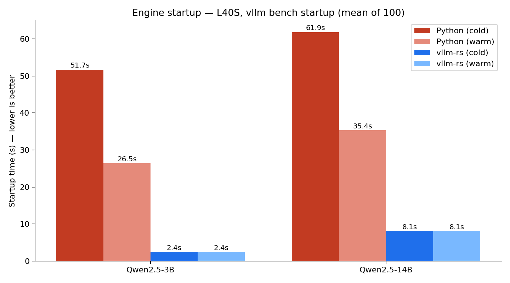
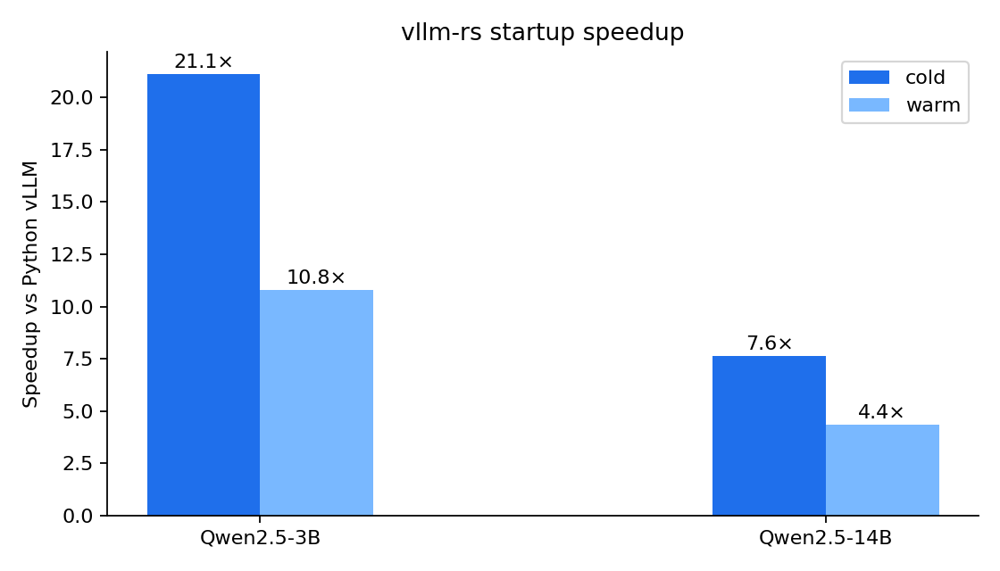

# vllm-rs

A Rust port of vLLM — built for **fast cold starts** and **structured KV reuse**.

---

## Why a Rust port?

- vLLM is the de-facto OSS inference engine — but it's a Python orchestrator wrapping CUDA.
- Python startup, import graph, and torch init dominate **time-to-first-token on cold boot**.
- Rust gives us a single static binary, deterministic init, and a place to hang **first-class cache primitives** (spans) that don't fit the Python data model.
- Goal: match Python vLLM **token-for-token and tok/s-for-tok/s** — then beat it where the architecture lets us.

---

## Story #1 — Startup Time

Measured on an L40S (`vllm bench startup`, n=100, mean):

| Model                | Python cold | Python warm | vllm-rs | Cold speedup | Warm speedup |
|----------------------|-------------|-------------|---------|--------------|--------------|
| Qwen2.5-3B           | 51.7 s      | 26.5 s      | **2.4 s** | **~21×**     | **~11×**     |
| Qwen2.5-14B          | 61.9 s      | 35.4 s      | **8.1 s** | **~7.6×**    | **~4.4×**    |

Where the time goes — and where it disappears:

| Stage                  | Python vLLM | vllm-rs |
|------------------------|-------------|---------|
| Interpreter + imports  | torch / transformers / triton — multi-second | **gone** |
| Engine / scheduler init| Python objects, GC | static Rust structs |
| Worker spawn           | `multiprocessing`, IPC handshakes | in-process threads |
| Model weights → device | same | same |
| CUDA graph capture     | same | same, gated per shape |

The parts that *aren't* "load the weights" effectively vanish.

---

## Speedup at a glance

vllm-rs has effectively **no cold-start tax** — the warm number *is* the cold number, because there's nothing to warm up.

---

## Why startup actually matters

- **Serverless / per-tenant LLMs.** Cold starts are user-visible latency, not a one-time cost.
- **CI and evals.** Every benchmark, every regression run, every notebook pays the tax.
- **Nested / agentic workloads.** Spawning a sub-engine for a judge or a tool stops being prohibitive.
- **Local / on-device.** On laptops (MLX) and edge boxes, "import torch" is the slowest thing on the machine.

Fast startup turns vLLM from an *always-on service* into a *callable function*.

---

## Story #2 — Span Queries

**Problem:** standard prefix caching is positional.

`[doc_A, doc_B, query_1]` and `[doc_B, doc_A, query_2]` share **zero** cache — even though the documents are identical.

For RAG, agent memories, and nested generates, this is most of the workload.

---

## Spans: position-independent KV blocks

vllm-rs introduces **Relocatable blocks** — KV cache blocks whose hash is independent of where they appear in the sequence.

- A SPNL query (`/v1/query/execute`) describes the structure: which blocks are documents (relocatable), which are query context (prefixed).
- The block hasher resets the parent chain at relocatable boundaries → same content, same key, **any order**.
- The attention path runs a per-block **rotate → attend → un-rotate** cycle so RoPE stays correct while cached K stays position-free.
- `seal` + `volatile` flags let nested generates cache their output for the *outer* call and then evict cleanly.

No special tokens. No prompt rewriting. Just a sparse annotation map alongside the token stream.

---

## What spans unlock

- **Order-independent RAG.** Re-rank or shuffle retrieved chunks per query — pay prefill **once**, ever.
- **Nested generates.** "Generate 5 candidates, then judge" reuses the candidates' KV in the judge call.
- **Shared corpora across tenants.** A document block hashed once is reusable by every request that mentions it, regardless of position.
- **Cross-request memoization** without bespoke cache servers — it's just the existing block pool with a second index.

The Python engine cannot express this without invasive changes to the scheduler and the attention kernels. In vllm-rs it's a first-class request type.

---

## Where we are

- **CUDA:** spans are functional end-to-end. `vllm bench spans` measures the A/B.
- **MLX (Apple Silicon):** prefill + decode span kernels landed; model wiring in progress.
- **Parity:** vllm-rs tracks Python vLLM behavior as the reference — we port, we don't reinvent.
- **Next:** fuse the rotate/un-rotate into FA2, full nested-generate orchestration in `/v1/query/execute`, MLX feature parity.

**The pitch:** same model quality, dramatically faster to start, and a cache model that finally fits how people actually use LLMs.
